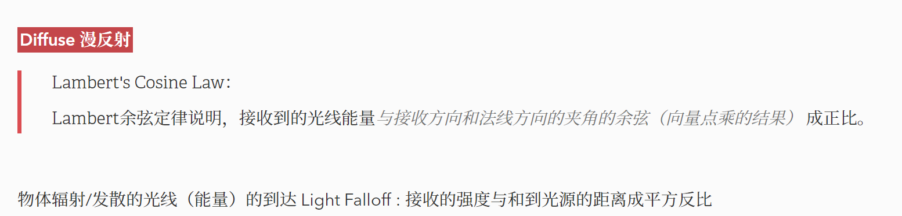

# Ursine-cn

对Typora主题Ursine做了个人偏好的中文的适配，相比于原主题Ursine，实现了

- 中文字体改为思源宋体（由于是有衬线字体，更适用于高分屏）  
- 自适应页面宽度，适用于大屏显示（-lim文件为原本宽度的版本）  
- 斜体颜色改为灰色，更为低调  
- "强调”颜色的背景与深红主题相适应  
- “引用”块的字体颜色改为正常颜色  

相关细节：

注意：不包括思源宋体，需要单独安装Source Han Serif CN方可使用
